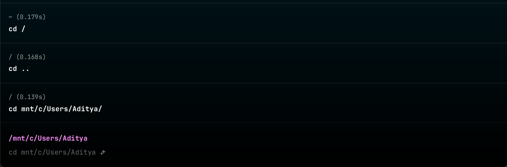

# Lab Experiment 1

## Files / Directory

1. `cd` : **Change Directory**
    - **When to use**: When you want to change the current working directory.
    - **Example** :
    
    ```bash
    cd /home/user/Documents  # Change to a specific directory
    cd ..  # Move up one directory level
    cd ~  # Change to the home directory
    ```
    
    - **Image** :
    
    
    

1. `ls` : **List Directory**
    - **When to use :**
    - **Example :**
        
        ```bash
        ls
        ls -l  # Long listing format
        ls -a  # Include hidden files
        ```
        
    - **Image :**
        
        
        

1. **`pwd`  :  Present Working Directory**
    - **When to use** :
    - **Example :**
        
        ```bash
        pwd
        ```
        
    - **Image** :
        
        
        

1. **`mkdir`  :  Make Directory**
    - **When to use** :
    - **Example :**
        
        ```bash
        mkdir new_folder
        mkdir -p parent/child  # Create parent directories as needed
        ```
        
    - **Image** :
        
        
        

1. `rmdir` : Remove Empty Directories
    - **When to use :** When you need to delete empty directories from the filesystem. Unlike `rm`, `rmdir` only works if the directory contains no files or subdirectories.
    - **Example :**
        
        ```bash
        rmdir my_empty_folder   # Remove an empty directory named 'my_empty_folder'
        rmdir -p dir1/dir2/dir3 # Remove nested empty directories in the given path
        rmdir test1 test2 test3 # Remove multiple empty directories
        ```
        
    - **Image :**
        
        
        
2. `chmod` : Change File Permissions
    - **When to use :** When you need to modify the access permissions (read, write, execute) for files or directories. It is commonly used to secure files by restricting or granting access to users or groups.
        
        
        
    - **Symbolic Mode:** Uses symbols to modify permissions relative to current ones.
        - `u` (user), `g` (group), `o` (others), `a` (all).
        - `+` (add), `` (remove), `=` (set exact).
    - **Example :**
        
        ```bash
        # Syntax
        chmod [options] mode file
        
        chmod +x script.sh   # Make a script executable for everyone
        chmod o-w private.txt # remove write permissions for others
        ```
        
    - **Image :**
        
        
        
3. `mv` : Move or Rename Files and Directories
    - **When to use :** When you need to move files/directories from one location to another or rename them.
    - **Example :**
        
        ```bash
        mv file1.txt /home/user/Documents/   # Move 'file1.txt' to 'Documents' folder
        mv report.doc report_backup.doc      # Rename 'report.doc' to 'report_backup.doc'
        mv my_folder/ /home/user/             # Move 'my_folder' to another directory
        mv *.txt /home/user/TextFiles/        # Move all .txt files to 'TextFiles' folder
        ```
        
    - **Image :**
        
        
        
        
        
4. `rm` : Remove Files or Directories
    - **When to use :** When you need to delete files or directories from the filesystem. Be cautious, as this command permanently removes data by default without placing it in the trash.
    - **Example :**
        
        ```bash
        rm file.txt         # Remove a single file
        rm file1.txt file2.txt  # Remove multiple files
        rm -r my_folder  # Remove the directory and everything inside it
        rm -f file.txt      # Force removal without confirmation or errors
        
        ```
        
    - **Image :**
        
        
        
5. `cp` : Copy Files or Directories
    - **When to use :**  When you need to copy files or directories from one location to another.
    - **Example :**
        
        ```bash
        cp file1.txt /home/user/  # Copy 'file1.txt' to the '/home/user/' directory
        cp -r folder1/ folder2/   # Copy the entire 'folder1' directory into 'folder2'
        cp file1.txt file2.txt    # Copy 'file1.txt' and save it as 'file2.txt' in the same directory
        cp -i file1.txt /home/user/  # Ask before overwriting a file if alreay a file exit of same name
        ```
        
    - **Image :**
        
        
        
6. `touch` : Create Empty Files or Update Timestamps
    - **When to use :** When you need to create an empty file or update the access and modification timestamps of an existing file without modifying its contents.
    - **Example :**
        
        ```bash
        touch newfile.txt       # Create an empty file named 'newfile.txt'
        touch file1.txt         # Update the timestamp of 'file1.txt'
        touch file1.txt file2.txt  # Create or update multiple files
        touch -c existingfile.txt  # Don't create a new file, only update timestamp if file exists
        ```
        
    - **Image :**
        
        
        
7. `cat` : Concatenate and Display File Content
    - **When to use :** When you need to display the content of a file, concatenate multiple files, or create new files by redirecting input.
    - **Example :**
        
        ```bash
        cat file1.txt         # Display the content of 'file1.txt'
        cat file1.txt file2.txt  # Concatenate and display contents of 'file1.txt' and 'file2.txt'
        cat file1.txt > newfile.txt  # Redirect content of 'file1.txt' to 'newfile.txt'
        cat file1.txt >> file2.txt  # Append content of 'file1.txt' to 'file2.txt'
        
        ```
        
    - **Image :**
        
        
        

## Search / Filter

1. `locate` : Find Files by Name Quickly
    - **When to use :** When you need to quickly search for files and directories by name across the entire system.
    - **Example :**
        
        ```bash
        # syntax
        locate [options] pattern
        
        locate myfile.txt          # Find all occurrences of "myfile.txt"
        locate -i report           # Case-insensitive search for "report"
        locate -c myfile.txt       # Count the number of matches
        locate '*.jpg'             # Find all JPG files
        locate -l 10 document      # Limit the output to 10 results
        ```
        
    - **Image :**
2. `find` : Search for Files and Directories
    - **When to use :** When you need to search for files or directories based on various criteria such as name, size, modification date, etc.
    - **Example :**
        
        ```bash
        #syntax
        find [path] [options] [expression]
        
        find . -name "*.txt"  # Find all '.txt' files in the current directory
        find . -type f  # Find all regular files
        find . -type d  # Find all directories in the current directory
        find /home/user/ -size +1G  # Find files larger than 1GB
        find . -mtime -7  # Find files modified in the last 7 days
        ```
        
    - **Image :**
        
        
        
        
        
3. `grep` : Search for Patterns in Files
    - **When to use :** When you need to search for a specific text pattern (string, regular expression, etc.) in files.
    - **Example :**
        
        ```bash
        #syntax
        grep [options] pattern [file...]
        
        grep "error" file1.txt         # Search for the string "error" in 'file1.txt'
        grep -r "warning" .            # Search for "warning" recursively in the current directory
        grep -i "success" file1.txt    # Case-insensitive search for "success"
        grep -l "failed" *.log         # List files containing the string "failed"
        ```
        
    - **Image :**
        
        
        
        
        
4. `cut` : Remove Sections from Each Line of Files
    - **When to use :** When you need to extract specific columns or fields from a file or input, typically when dealing with delimited data.
    - **Example :**
        
        ```bash
        cut -d ":" -f 1 /etc/passwd         # Extract the first field (username) from '/etc/passwd' using ':' as a delimiter
        cut -d "," -f 2 file.csv            # Extract the second field from a CSV file
        cut -c 1-5 file.txt                 # Extract the first 5 characters from each line in 'file.txt'
        echo "name:age:city" | cut -d ":" -f 2  # Extract 'age' from a colon-delimited string
        ```
        
    - **Image :**
        
        
        
5. `head` : Display the First 10 Lines of a File
    - **When to use :** When you need to view the beginning (default is the first 10 lines) of a file or output from a command.
    - **Example :**
        
        ```bash
        head file1.txt                 # Display the first 10 lines of 'file1.txt'
        head -n 5 file1.txt            # Display the first 5 lines of 'file1.txt'
        head -n 10 file1.txt           # Display the first 10 lines (default)
        head -c 50 file1.txt           # Display the first 50 bytes of 'file1.txt'
        tail -n +11 file1.txt | head -n 5  # Skip the first 10 lines and show the next 5 lines
        ls -l | head                   # List files and show the top 10 lines of the output
        ```
        
    - **Image :**
        
        
        
        
        
6. `tail` : Display the Last 10 Lines of a File
    - **When to use :** When you need to view the end (default is the last 10 lines) of a file or output from a command, often used for monitoring logs.
    - **Example :**
        
        ```bash
        tail file1.txt               # Display the last 10 lines of 'file1.txt'
        tail -n 5 file1.txt          # Display the last 5 lines of 'file1.txt'
        tail -n 10 file1.txt         # Display the last 10 lines (default)
        tail -c 50 file1.txt         # Display the last 50 bytes of 'file1.txt'
        tail -f /var/log/syslog      # Continuously monitor the 'syslog' file for new entries
        ```
        
    - **Image :**
        
        
        

## Info for commands

1. `man` : Display the Manual Pages for Commands
    - **When to use :** When you need detailed documentation about a command, its options, and how to use it.
    - **Example :**
        
        ```bash
        man ls           # Display the manual page for the 'ls' command
        man grep         # Display the manual page for the 'grep' command
        man find         # Display the manual page for the 'find' command
        man -k "search"  # Search the manual for all entries containing the word 'search'
        ```
        
    - **Image :**
        
        
        
2. `info` : Display the Info Pages for Commands
    - **When to use :**  When you need more detailed and structured documentation than what `man` provides. The `info` command typically offers more extensive documentation, including examples and explanations.
    - **Example :**
        
        ```bash
        info ls           # Display the info page for the 'ls' command
        info grep         # Display the info page for the 'grep' command
        info find         # Display the info page for the 'find' command
        ```
        
    - **Image :**
        
        
        
3. `whatis` : Display a One-Line Description of a Command
    - **When to use :** When you want a brief summary or description of a command without going into the detailed documentation.
    - **Example :**
        
        ```bash
        whatis vim
        whatis ls          # Show a short description of the 'ls' command
        whatis grep        # Show a short description of the 'grep' command
        whatis find        # Show a short description of the 'find' command
        ```
        
    - **Image :**
        
        
        
4. `whereis` : Locate the Binary, Source, and Manual Page of a Command
    - **When to use :** When you want to find the location of a command's binary, source code, and manual pages.
    - **Example :**
        
        ```bash
        whereis ls         # Locate the binary, source, and man page for the 'ls' command
        whereis grep       # Locate the binary, source, and man page for the 'grep' command
        whereis -b ls      # Only locate the binary file for 'ls'
        whereis -m ls      # Only locate the manual page for 'ls'
        ```
        
    - **Image :**
        
        
        
5. `whoami` : Display the Current User's Username
    - **When to use :** When you need to find out the username of the currently logged-in user.
    - **Example :**
        
        ```bash
        whoami
        ```
        
    - **Image :**
        
        
        

## Archive / Compression

1. `tar` : Archive Files and Directories
    - **When to use :** When you need to create archives (compressed or uncompressed) of files and directories, or when you need to extract files from an archive. It's commonly used for backups or packaging files for distribution.
    - **Example :**
        
        ```bash
        tar -cvf archive.tar directory/  # Create an archive of a directory
        tar -cvf archive.tar file1.txt file2.txt  # Archive specific files
        ```
        
    - **Image :**
        
        
        
        
        
2. `untar` : Extract Files from a Tar Archive
    - **When to use :** Use "untar" to extract files from a `.tar` or `.tar.gz` (compressed) archive. This is commonly used for unpacking backups, software packages, or transferring multiple files.
    - **Options Explained**:
        - `x`: Extract files from the archive.
        - `v`: Verbose mode; shows details of files being extracted.
        - `f`: Specifies the archive file name.
        - `z`: Handles gzip-compressed archives (`.tar.gz`).
        - `j`: Handles bzip2-compressed archives (`.tar.bz2`).
        - `J`: Handles xz-compressed archives (`.tar.xz`).
    - **Example :**
        
        ```bash
        tar -xvf archive.tar        # Extract a `.tar` file
        tar -xvzf archive.tar.gz    # Extract a compressed `.tar.gz` file
        tar -xvjf archive.tar.bz2   # Extract a `.tar.bz2` file
        tar -xvJf archive.tar.xz    # Extract a `.tar.xz` file
        ```
        
    - **Image :**
        
        
        
3. `bunzip2` :  Decompress `.bz2` Files
    - **When to use :** Use `bunzip2` to decompress files that have been compressed using the `bzip2` compression method. It is useful when you need to extract the original file from a `.bz2` archive.
    - **Example :**
        
        ```bash
        bunzip2 file.bz2
        ```
        
    - **Image :**
        
        
        
4. `gunzip2` : Decompress `.gz` Files
    - **When to use :** Use `gunzip` to decompress files compressed with the `gzip` utility. It restores the original file from a `.gz` archive.
    - **Example :**
        
        ```bash
        gunzip file.gz
        ```
        
    - **Image :**
        
        
        
5. `bzip` : Compress Files Using the Bzip2 Algorithm
    - **When to use :** Use `bzip2` to compress large files to save disk space or prepare them for efficient file transfer. It creates `.bz2` files, which are smaller than the original.
    - **Example :**
        
        ```bash
        bzip2 file.tar
        ```
        
    - **Image :**
        
        
        
6. `gzip` : Compress Files
    - **When to use :** When you need to compress files to reduce their size, typically for storage or transferring over networks. `gzip` is often used with the `tar` command to compress archives.
    - **Example :**
        
        ```bash
        gzip file.txt            # Compress the file.txt to file.txt.gz
        gzip -d file.txt.gz      # Decompress the file.txt.gz back to file.txt
        gzip -l file.txt.gz      # List information about the compressed file
        gzip -v file.txt         # Compress the file and display the compression progress
        ```
        
    - **Image :**
        
        
        

## System monitoring

1. `top` : Display Linux Processes and System Resource Usage
    - **When to use :** When you need to monitor system processes, CPU usage, memory usage, and other performance metrics in real-time.
    - **Example :**
        
        ```bash
        top
        ```
        
    - **Image :**
        
        
        
2. `htop` : Interactive Process Viewer
    - **When to use :** When you need a more user-friendly, colorized, and interactive alternative to the `top` command for monitoring system processes and resource usage.
    - **Example :**
        
        ```bash
        htop
        ```
        
    - **Image :**
        
        
        
3. `ps` : Display Information About Running Processes
    - **When to use :** When you need to view details about currently running processes on your system, such as their IDs, status, and resource usage.
    - **Example :**
        
        ```bash
        ps            # Display processes running in the current terminal session
        ps aux        # Display all processes running on the system with detailed info
        ps -ef        # Display processes in a full-format listing (similar to `ps aux`)
        ps -u username # Display processes running by a specific user
        ```
        
    - **Image :**
        
        
        
4. `fg` : Bring a Job to the Foreground
    - **When to use :** When you want to bring a background job (a process running in the background) to the foreground, so you can interact with it directly in the terminal.
    - **Example :**
        
        ```bash
        fg         # Bring the most recent background job to the foreground
        fg %1      # Bring the job with job ID 1 to the foreground
        fg %2      # Bring the job with job ID 2 to the foreground
        ```
        
    - **Image :**
        
        
        
        
        
5. `bg` : Send a Job to the Background
    - **When to use :** When you want to resume a suspended job (a process that has been paused) and run it in the background, allowing you to continue using the terminal for other tasks.
    - **Example :**
        
        ```bash
        bg         # Resume the most recent suspended job in the background
        bg %1      # Resume the job with job ID 1 in the background
        bg %2      # Resume the job with job ID 2 in the background
        ```
        
    - **Image :**
        
        
        

## Network

1. `ping` : Test Network Connectivity 
    - **When to use :** When you need to check the network connectivity to a specific host (IP address or domain) to verify if it is reachable.
    - **Example :**
        
        ```bash
        ping iditya.tech   # Send ICMP echo requests to iditya.tech to check connectivity
        ping 1.1.1.1     # Send ICMP echo requests to a specific IP address (e.g., Cloudflare's DNS server)
        ping -c 4 google.com  # Send 4 pings to google.com and then stop
        ```
        
    - **Image :**
        
        
        
2. `ifconfig` : Configure Network Interfaces
    - **When to use :** When you need to display or configure network interfaces on your system, including checking the IP address, netmask, broadcast address, and more.
    - **Example :**
        
        ```bash
        ifconfig        # Display network interfaces and their configuration
        ifconfig eth0   # Display configuration for the 'eth0' interface
        ifconfig eth0 up  # Bring the 'eth0' network interface up
        ifconfig eth0 down  # Disable the 'eth0' network interface
        ```
        
    - **Image :**
        
        
        
3. `ifup` : Bring a Network Interface Up
    - **When to use :**When you need to activate or bring a network interface (that is currently down or inactive) up to establish a network connection.
    - **Example :**
        
        ```bash
        ifup eth0    # Bring the 'eth0' network interface up
        ifup wlan0   # Bring the 'wlan0' wireless network interface up
        ```
        
    - **Image :**
        
        
        
4. `ifdown` : Bring a Network Interface Down
    - **When to use :**When you need to deactivate or bring a network interface (that is currently active) down, essentially disabling network connectivity for that interface.
    - **Example :**
        
        ```bash
        ifdown eth0    # Bring the 'eth0' network interface down
        ifdown wlan0   # Bring the 'wlan0' wireless network interface down
        ```
        
    - **Image :**
        
        
        
5. `netstat` : Network Statistics
    - **When to use :** When you need to display network connections, routing tables, interface statistics, and other network-related information on your system.
    - **Example :**
        
        ```bash
        netstat            # Display active network connections (TCP/UDP)
        netstat -t         # Display only TCP connections
        netstat -u         # Display only UDP connections
        netstat -l         # Show only listening ports
        netstat -r         # Display the routing table
        netstat -i         # Show network interface statistics
        netstat -an        # Display all connections and listening ports in numeric form
        
        # socket stat (ss) --> Improved
        ss -tuln    # Equivalent to netstat -tuln
        ```
        
    - **Image :**
        
        
        
        
        
6. `ip addr` : Show or Configure Network Interfaces
    - **When to use :** When you need to display the IP address and configuration of network interfaces on your system, or when you need to manage network configurations
    - **Example :**
        
        ```bash
        ip addr            # Show all network interfaces and their IP addresses
        ip addr show       # Show IP addresses of all interfaces
        ip addr show eth0  # Show IP address of the 'eth0' interface
        ```
        
    - **Image :**
        
        
        

## Memory

1. `free` : Display Memory Usage
    - **When to use :** When you need to display information about system memory usage, including total, used, free, shared, and available memory, as well as swap space.
    - **Example :**
        
        ```bash
        free            # Display memory usage in kilobytes
        free -h         # Display memory usage in a human-readable format (KB, MB, GB)
        free -m         # Display memory usage in megabytes
        free -g         # Display memory usage in gigabytes
        ```
        
    - **Image :**
        
        
        
2. `vmstat` : Virtual Memory Statistics
    - **When to use :** When you need to monitor system performance, including memory usage, processes, paging, block I/O, interrupts, and CPU activity.
    - **Example :**
        
        ```bash
        vmstat           # Display memory statistics and system performance
        vmstat 2         # Display statistics every 2 seconds
        vmstat 2 5       # Display statistics every 2 seconds, for a total of 5 reports
        vmstat -s        # Display summary of memory statistics
        ```
        
    - **Image :**
        
        
        
3. `/proc/meminfo` : Memory Information File
    - **When to use :** Use `/proc/meminfo` to view detailed information about the system's memory usage. This file provides real-time stats on RAM, swap space, and other memory-related details.
    - **Example :**
        
        ```bash
        cat /proc/meminfo           # View the memory information file
        ```
        
    - **Image :**
        
        
        

## Advanced

1. `last` : View Login History
    - **When to use :** Use the `last` command to display a list of the most recent user logins, reboots, and shutdowns on the system. It fetches this information from the `/var/log/wtmp` file.
    - **Example :**
        
        ```bash
        last
        ```
        
    - **Image :**
        
        
        
2. `lastb`
    - **When to use :**
    - **Example :**
        
        ```bash
        
        ```
        
    - **Image :**
3. `reboot` : Reboot the System
    - **When to use :** When you need to reboot the system immediately, either for maintenance, after installing updates, or to resolve certain issues.
    - **Example :**
        
        ```bash
        reboot                # Reboot the system immediately
        reboot -f             # Force a reboot (bypass shutdown process)
        reboot -p             # Power off the system after rebooting
        ```
        
4. `shutdown` : Shut Down or Restart the System
    - **When to use :** When you need to safely shut down or restart the system, either immediately or at a specified time. This command helps to ensure that all processes are properly closed and filesystems are unmounted before the system shuts down.
    - **Example :**
        
        ```bash
        shutdown now           # Immediately shut down the system
        shutdown -r now        # Reboot the system immediately
        shutdown -h +10        # Shut down the system in 10 minutes
        shutdown -h 22:00      # Shut down the system at 10 PM
        shutdown -h now "System will shut down for maintenance."  # Immediate shutdown with a message
        ```
        
5. `at` : Schedule a Command to Run Later
    - **When to use :** Use the `at` command to schedule a command or script to run once at a specific time in the future. It is useful for running one-time tasks.
    - **Example :**
        
        ```bash
        echo "echo 'Task executed'" | at 14:00
        atq    # list all pending Jobs
        atrm 4 # Deletes the job with ID 4
        ```
        
    - **Image :**
        
        
        
        
        
6. `cron` : Schedule Repeated Tasks
    - **When to use :** Use `cron` to automate repetitive tasks such as backups, log cleanups, sending emails, and system maintenance.
    - **Example :**
        
        ```bash
        # Edit this file to introduce tasks to be run by cron.
        # Example of job definition:
        # .---------------- minute (0 - 59)
        # |  .------------- hour (0 - 23)
        # |  |  .---------- day of month (1 - 31)
        # |  |  |  .------- month (1 - 12) OR jan,feb,mar,apr ...
        # |  |  |  |  .---- day of week (0 - 7) (0 and 7 both mean Sunday)
        # |  |  |  |  |
        # *  *  *  *  * command to execute
        
        # minute hour day-of-month month day-of-week command
        ```
        
        ```bash
        
        ```
        
    - **Image :**
7. `apropos` : Search Manual Pages by Keywords
    - **When to use :** Use `apropos` to search the system manual pages for commands and their descriptions based on a keyword. It helps when you're unsure about the exact command but know what you want to achieve.
    - **Example :**
    
    ```bash
    # apropos [options] keyword
    apropos user
    apropos -e passwd
    ```
    
    - **Image :**
        
        
        
8. `bc` : Basic Calculator
    - **When to use :** Use `bc` for performing advanced mathematical calculations directly from the command line. It supports floating-point arithmetic, custom scales (precision), and even scripting for complex calculations.
    - **Example :**
        
        ```bash
        echo "5 + 3" | bc
        ```
        
    - **Image :**
        
        
        
9. `chown` : Change Ownership
    - **When to use :** Use `chown` to change the ownership of files or directories. It allows you to specify a new owner (user) and group for a file or directory.
    - **Example :**
        
        ```bash
        # chown [options] [owner][:group] file
        sudo chown user1 file.txt
        sudo chown -R user2:group2 /path/to/directory
        ```
        
    - **Image :**
        
        
        
10. `chroot` : Change Root Directory
    - **When to use :** Use `chroot` to change the root directory for a command or process, effectively isolating it within a specific part of the filesystem. This is useful for testing, recovery, or creating isolated environments.
    - **Example :**
        
        ```bash
        sudo chroot /mnt/recovery              # Change root to `/mnt/recovery` (interactive shell)
        sudo chroot /mnt/debian /bin/bash      # Change root and launch Bash shell
        sudo chroot /mnt/ubuntu ls /           # Run the `ls` command within the new root directory
        sudo chroot /newroot --userspec=1000:1000 /bin/bash  # Run shell with specific user ID and group ID
        ```
        
    - **Image :**
11. `convert` : Image Conversion and Manipulation
    - **When to use :** Use `convert` to manipulate and transform image files. It is part of the **ImageMagick** suite, which allows operations like format conversion, resizing, cropping, annotating, and applying effects to images.
    - **Example :**
        
        ```bash
        convert image.png image.jpg        # Convert an image from PNG to JPG format
        convert image.jpg -resize 50% resized_image.jpg  # Resize an image to 50% of its original size
        convert image.jpg -crop 200x200+10+10 cropped_image.jpg  # Crop a 200x200 area from (10, 10) position
        convert image.jpg -rotate 90 rotated_image.jpg   # Rotate an image by 90 degrees
        convert image.jpg -flip flipped_image.jpg        # Flip the image vertically
        convert image.jpg -quality 80 compressed_image.jpg  # Compress the image with 80% quality
        convert image1.jpg image2.jpg merged.pdf         # Merge multiple images into a single PDF
        ```
        
    - **Image :**
        
        
        
12. `diff` : Find Differences Between Files
    - **When to use :** Use `diff` to compare two files line by line and display their differences. It is commonly used for text files to show changes or edits.
    - **Example :**
        
        ```bash
        diff file1.txt file2.txt          # Compare two files line by line
        diff -y file1.txt file2.txt       # Display the differences side by side
        diff -c file1.txt file2.txt       # Show differences with surrounding context
        diff -u file1.txt file2.txt       # Display unified format with minimal context
        diff --ignore-case file1.txt file2.txt  # Ignore case differences
        ```
        
    - **Image :**
        
        
        
13. `cmp` : Compare Two Files
    - **When to use :** Use `cmp` to compare two files byte by byte. It is helpful for determining if two files are identical or locating the first difference between them.
    - **Example :**
        
        ```bash
        cmp file1.txt file2.txt         # Compare two files and report the first difference
        cmp -l file1.txt file2.txt      # Display differing bytes in detail
        cmp -s file1.txt file2.txt      # Silent mode; no output, only the exit code
        ```
        
    - **Image :**
        
        
        
14. `df` : Display Disk Space Usage
    - **When to use :** Use `df` to display the available and used disk space for file systems mounted on your system. It provides an overview of storage capacity and usage.
    - **Example :**
        
        ```bash
        df                     # Show disk space usage for all mounted file systems
        df -h                  # Display disk space usage in a human-readable format (e.g., KB, MB, GB)
        df -T                  # Include the file system type (e.g., ext4, xfs, etc.)
        df -i                  # Show inode usage instead of disk space usage
        df /home               # Display disk space usage for a specific directory or file system
        ```
        
    - **Image :**
        
        
        
15. `du` : Disk Usage
    - **When to use :**  Use `du` to estimate and display the amount of disk space used by files and directories. It's helpful for analyzing storage usage and identifying large files or directories.
    - **Example :**
        
        ```bash
        du                      # Show disk usage of the current directory and its subdirectories
        du -h                   # Display disk usage in a human-readable format (e.g., KB, MB, GB)
        du -sh directory/       # Show the total size of a specific directory
        du -a                   # Show the size of all files and directories
        du -h --max-depth=1     # Display sizes of directories in the current directory (1 level deep)
        du -h file.txt          # Show the size of a specific file
        ```
        
    - **Image :**
        
        
        
        
        
16. `egrep` : Extended Global Regular Expression Print
    - **When to use :** Use `egrep` to search for patterns in files or text using extended regular expressions. It is a faster and extended version of the `grep` command, supporting more powerful pattern matching.
    - **Example :**
        
        ```bash
        egrep "pattern" file.txt
        egrep "cat|dog" file.txt
        ```
        
    - **Image :**
        
        
        
17. `pgrep` : Process ID Lookup
    - **When to use :** Use `pgrep` to find the process IDs (PIDs) of running processes by name or pattern. It is a convenient alternative to using `ps` combined with `grep`.
    - **Example :**
        
        ```bash
        pgrep firefox
        pgrep -l bash
        ```
        
    - **Image :**
        
        
        
18. `finger` : Display User Information
    - **When to use :** When you need to view information about a user on the system, such as their login name, home directory, shell, and more. It can be helpful for managing users or checking user status.
    - **Example :**
        
        ```bash
        finger               # Display information about all users logged in
        finger username      # Display information about a specific user
        finger -l username   # Display detailed information about a specific user
        ```
        
    - **Image :**
        
        
        
19. `date` : Display or Set the System Date and Time
    - **When to use :** When you need to display the current date and time or set the system's date and time.
    - **Example :**
        
        ```bash
        date                # Display the current date and time
        date "+%Y-%m-%d"    # Display the date in YYYY-MM-DD format
        date "+%T"          # Display the time in HH:MM:SS format
        date -u             # Display the date and time in UTC
        date "+%A, %B %d, %Y %I:%M%p"  # Display date and time in a custom format
        ```
        
    - **Image :**
        
        
        
        
        
20. `time` : Measure the Time a Command Takes to Execute
    - **When to use :** When you need to measure how long a command or process takes to execute. It can be used to assess the performance of programs or scripts.
    - **Example :**
        
        ```bash
        time ls              # Measure how long it takes to list directory contents
        time sleep 5         # Measure how long the sleep command takes to pause for 5 seconds
        time wget https://example.com  # Measure how long it takes to download a file
        ```
        
    - **Image :**
        
        
        
        
        
21. `echo` : Display a Line of Text or Variables
    - **When to use :** When you need to print text or the value of variables to the terminal. It's commonly used in scripting, debugging, or displaying simple messages.
    - **Example :**
        
        ```bash
        echo "Hello, World!"    # Print a simple string
        echo $HOME              # Print the value of the HOME environment variable
        echo "Path: $PATH"      # Display a message with the value of an environment variable
        echo -n "No newline"    # Print text without a newline at the end
        echo -e "Line 1\nLine 2"  # Enable interpretation of backslash escapes (e.g., newline)
        ```
        
    - **Image :**
        
        
        
        
        
22. `kill` : Terminate Processes by Process ID (PID)
    - **When to use :** When you need to send a signal to a process, typically to terminate it. It can be used to stop unresponsive or unnecessary processes on a system.
    - **Example :**
        
        ```bash
        sudo netstat -tulpn | grep :5137  # my react app localhost port
        kill <PID>
        
        kill 1234           # Terminate the process with PID 1234
        kill -9 1234        # Forcefully terminate the process with PID 1234 (SIGKILL)
        kill -l             # List all available signals that can be sent to processes
        kill -15 1234       # Gracefully terminate the process with PID 1234 (SIGTERM)
        ```
        
    - **Image :**
        
        
        
23. `ln` : Create Links Between Files
    - **When to use :** Use the `ln` command to create hard links or symbolic links (symlinks) between files and directories. It is useful for creating shortcuts or referencing files in multiple locations without duplicating them.
    - **Types of Links**:
        1. **Hard Link**:
            - A direct reference to the same inode (data on disk) as the target file.
            - Cannot be created for directories.
            - Remains intact even if the original file is deleted (until all hard links to it are deleted).
        2. **Symbolic Link (Symlink)**:
            - A pointer or shortcut to the target file or directory.
            - Can link to files or directories, even on different file systems.
            - If the original file is deleted, the symlink becomes broken.
    - **Options**:
        - `s`: Create a symbolic (soft) link.
        - `f`: Force the creation of the link by removing any existing file with the same name as the link.
        - `v`: Display verbose output of what is being linked.
        - `n`: Treat the destination as a normal file if it is a symbolic link.
        - `i`: Prompt before overwriting existing files.
        - `T`: Treat the target as a file, not a directory.
    - **Example :**
        
        ```bash
        # Hard Link
        ln original.txt hardlink.txt
        
        # Soft Link
        ls -li original.txt softlink.txt
        ```
        
    - **Image :**
        - Hard Link
            
            
            
            
            
        - Soft Link
            
            
            
24. `unlink` : Remove a Single File
    - **When to use :** Use the `unlink` command to remove (delete) a single file by specifying its name. It is a simpler version of `rm` that can only delete one file at a time, and it does not support options for removing directories or multiple files.
    - **Example :**
        
        ```bash
        unlink filename
        ```
        
    - **Image :**
        
        